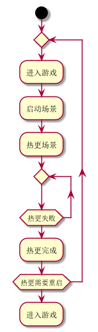
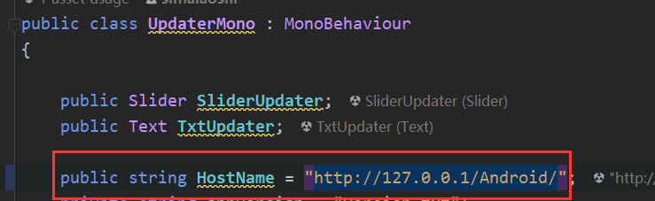

## huatuo的简单实践项目

### huatuo新手教程

官方文档链接[hybridclr_trial](https://github.com/focus-creative-games/HybridCLR_trial)

### 热更流程

整体的热更流程和普通的热更基本上差不多，没有需要太多介绍。



### 运行介绍

- 我这里的代码写的十分简陋，主要还是体验一下华佗的特性，没有做过多的设计，直接看流程就行了。

1. 直接build就行了，只需要打包LauncherScene就行了，之后全靠ab来执行，简单的的代码分析，如下

   ```c#
   public class LauncherMain : MonoBehaviour
   {
       private static AssetBundle UpdateScreenBundle { get; set; }
       private void Start()
       {
           LoadUpdateScene();
           Debug.Log("LauncherMain Start");
       }
   
       private void LoadUpdateScene()
       {
           var p = Path.Combine(Application.persistentDataPath, "launcher");
           if (!File.Exists(p))
               p = Path.Combine(Application.streamingAssetsPath, "launcher");
           UpdateScreenBundle = AssetBundle.LoadFromFile(p, 0, 0);
           #if !UNITY_EDITOR
               TextAsset dllBytes1 = UpdateScreenBundle.LoadAsset<TextAsset>("HotFixLauncher.dll.bytes");
           	System.Reflection.Assembly.Load(dllBytes1.bytes);
           #endif
               var updateGo = UpdateScreenBundle.LoadAsset<GameObject>("UpdaterPrefab");
           Instantiate(updateGo);
       }
   }
   ```

   直接在Start时候就加载我们的launcher，ab，然后加载dll的byte，实例化我们的更新需要用的UpdaterPrefab，这一步做的就是假如我们热更的逻辑也要修改，就可以直接更新，不可更新的部分就只有一个LauncherMain了（其实也可以更新，使用UnityCmd，把LauncherMain解析作为字符串使用，但是需要也要插件，这样全部就可以更新了）。

2. 如果上面不异常就会进入到我们的UpdaterMono.cs,这一步就是简单的热更新了，直接CS判断是否有差异，有就更新，没有就跳过，我这里写的十分简单，主要还是体验一下，没有做过多的设计，如果更新到我们的launcher的AssetBundle就说明我们的Updater也需要更新了，就需要重启，没有就是直接进去游戏了。

3. 更新完成就直接进入我们的Logic场景了，后面就没什么太多描述了。

### 如何部署

1. 打包工程和huatuo新手教程一致
2. 找到自己打包的平台，我这里是Android平台**Assets/HuatuoBuildCache/AssetBundleOutput/Android**，也就是这目录，然后把这个目录挂载到我们的简易http服务器上吗，这里使用的是 [HFS](https://www.rejetto.com/hfs/)，直接拖上去就行了，大致是这个这样子,我这里用的本地地址，其他地址需要同一个局域下，需要能访问就行了。
3. 然后修改我们代码中的地址web服务器地址，当然也可以在预制体中修改。
4. 进行上面的基本配置工作后就可以运行了。
5. 先运行apk，然后第一次会全部下载，我没做第一次的处理，全部走下载，体验热更的话，简易修改一下代码然后编译dll然后打下ab就行了，如果我们在HFS中使用的是真实地址就不需要重新挂，如果是虚拟地址就需要重新挂。
